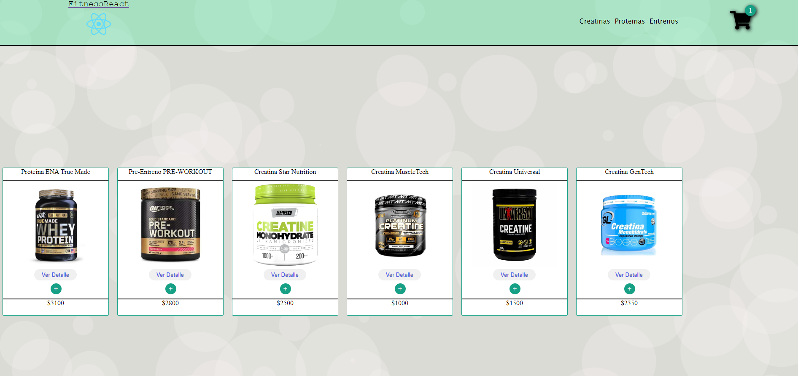
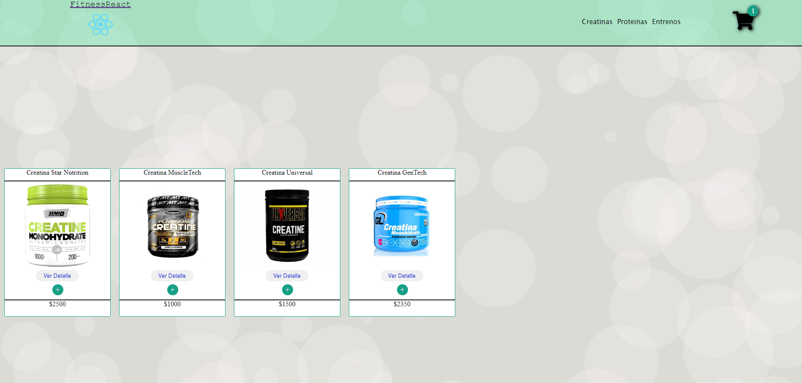
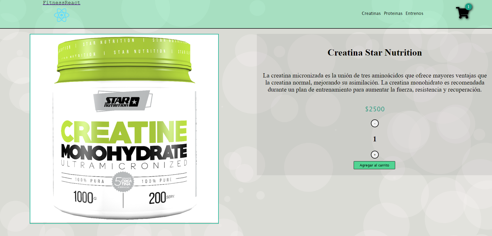

# Sobre este ecommerce
Decidí crear este comercio no dirigido a ningún emprendimiento en particular para ganar experiencia realizando el proyecto del curso de CoderHouse

FitnessReact es una tienda virtual de suplementos para entreno.

# **Screenshots **

---

### Home



### Productos filtrados



### Detalle productos




## **DEMO**

---


# Dependencias

## [Create React App](https://create-react-app.dev/)
## [React Router Dom](https://v5.reactrouter.com/web/guides/quick-start)

# Instalación
Clonar el proyecto y entrar en el directorio:
```bash
git clone https://github.com/coponico/React-Nicolas-Joli
cd React-Nicolas-Joli
```
Instalar la versión de npm recomendada
```bash
npm install
```
Instalar las dependencias:
```bash
npm install
```

Iniciar el servidor local:
```bash
npm start
```

# Comandos
+ **npm start**: inicia el servidor local


